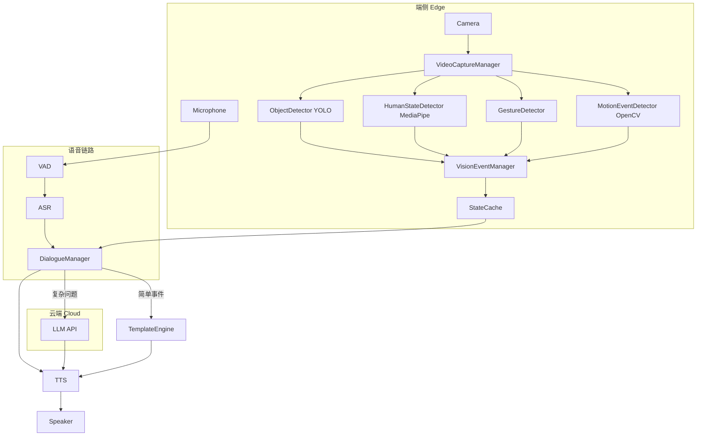
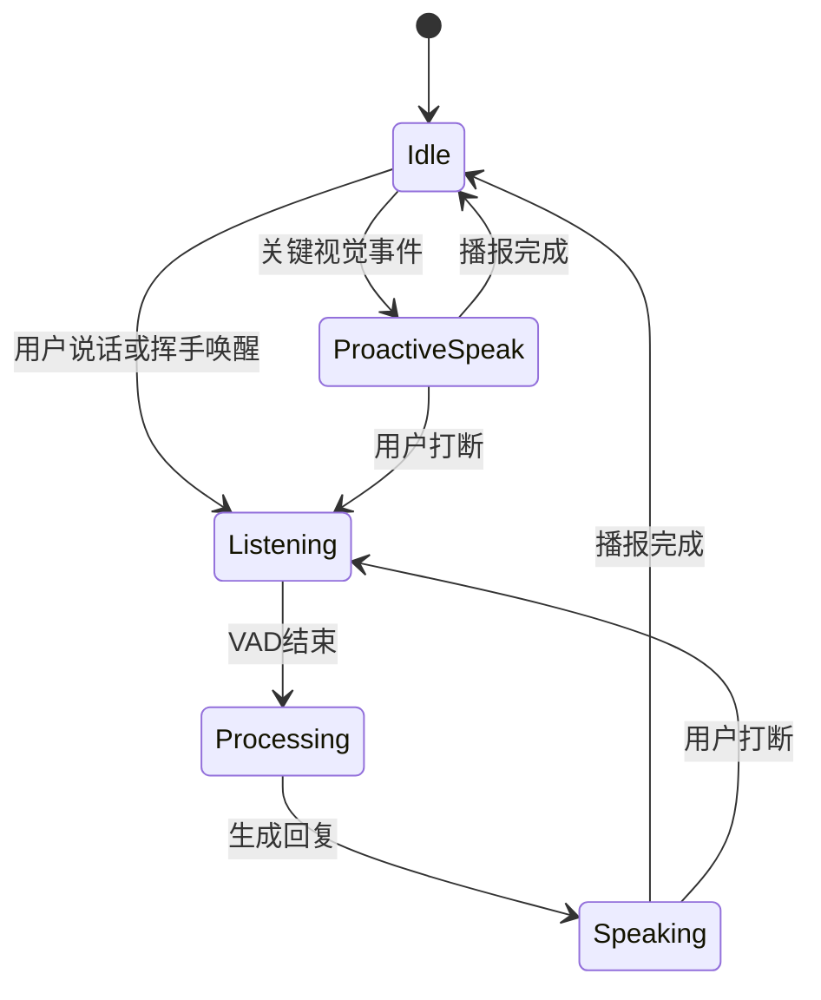

# EdgeVision Talker — 需求分析与产品设计文档

> **版本**：v1.0  
> **日期**：2026-06-13  
> **状态**：设计评审稿  
> **关联提案**：[one.md](./one.md)（技术选型调研）、[tow.md](./tow.md)（EdgeVision Talker 方案）

---

## 目录

1. [项目概述](#1-项目概述)
2. [需求分析](#2-需求分析)
3. [产品架构设计](#3-产品架构设计)
4. [模块设计](#4-模块设计)
5. [交互与 UI 设计](#5-交互与-ui-设计)
6. [端云协同与成本控制策略](#6-端云协同与成本控制策略)
7. [技术选型与实现路径](#7-技术选型与实现路径)
8. [实施计划与风险](#8-实施计划与风险)
- [附录 A：需求追溯矩阵](#附录-a需求追溯矩阵)
- [附录 B：演示脚本](#附录-b演示脚本)
- [附录 C：视觉上下文 JSON Schema](#附录-c视觉上下文-json-schema)
- [附录 D：LLM Prompt 模板](#附录-dllm-prompt-模板)
- [附录 E：依赖清单](#附录-e依赖清单)

---

## 1. 项目概述

### 1.1 背景

本项目需在 **48 小时内** 实现一个可演示的 AI 视觉对话助手 Demo，核心能力是：

- 打开摄像头与麦克风；
- 让 AI 能够「看到」摄像头中的视频内容、「听到」用户说的话；
- 基于视觉与语音输入，给予恰当、自然的回应。

同时需综合考虑：**视觉内容理解准确性**、**语音交互自然度与流畅性**、**端云协同的成本控制策略**。

### 1.2 产品名称与定位

| 项 | 说明 |
|----|------|
| **产品名称** | EdgeVision Talker |
| **中文名** | 低成本实时视觉对话助手 |
| **核心定位** | 不依赖视觉大模型逐帧理解，通过端侧计算机视觉（CV）将视频流解析为结构化视觉事件，再结合语音识别（ASR）与对话模型（LLM）实现「看得见、听得懂、说得自然」 |

### 1.3 设计原则

> **本地视觉感知 + 云端语义生成。** 视频流不直接上传云端，也不调用视觉大模型进行逐帧理解；画面先在本地通过 YOLO、MediaPipe、OpenCV 解析为结构化视觉事件（物体、人物、手势、运动变化等）。系统仅在用户发起语音请求或出现关键视觉事件时，将低频结构化文本发送给对话模块生成回应，从而兼顾视觉理解准确性、语音交互流畅性和云端调用成本控制。

### 1.4 目标用户与使用场景

| 用户 | 场景 |
|------|------|
| 演示/答辩参与者 | 3 分钟现场 Demo，展示端云协同与实时感知能力 |
| 桌面办公用户 | 轻量环境感知对话（「你看到桌上有什么？」） |
| 开发者/研究者 | 低成本视觉助手原型，可扩展 OCR、情绪识别等模块 |

### 1.5 成功标准（验收条件）

| # | 验收项 | 标准 |
|---|--------|------|
| AC-01 | 设备接入 | 摄像头与麦克风正常开启，画面实时预览无卡顿 |
| AC-02 | 视觉感知 | 能识别常见物体（人、杯子、手机等）、手势（挥手）、用户进出/遮挡 |
| AC-03 | 语音交互 | 用户语音提问后 **3 秒内** 得到语音回复 |
| AC-04 | 端云协同 | 云端 **不传原始视频帧**，仅传结构化 JSON 文本 |
| AC-05 | 演示就绪 | 具备事件日志面板，可按 3 分钟演示脚本完整走通 |

---

## 2. 需求分析

### 2.1 功能需求（FR）

| ID | 需求描述 | 优先级 | MVP | 验收标准 |
|----|----------|--------|-----|----------|
| FR-01 | 摄像头采集与实时预览 | P0 | 是 | 画面 ≥ 24 FPS 显示，支持检测框 overlay |
| FR-02 | 麦克风采集与语音识别（ASR） | P0 | 是 | 中文语音转文字准确率可接受，延迟 < 1s |
| FR-03 | 常见物体识别（YOLO，COCO 80 类） | P0 | 是 | 能识别 person、cup、cell phone、chair、book 等 |
| FR-04 | 手势识别（挥手/确认/停止等） | P0 | 是 | 至少支持挥手、竖大拇指、张开手掌 |
| FR-05 | 用户状态（在/离屏、遮挡、运动） | P0 | 是 | 检测用户进入/离开、摄像头被遮挡 |
| FR-06 | 语音合成（TTS）回复 | P0 | 是 | 助手回复可语音播报，支持打断 |
| FR-07 | 对话回应（规则模板 + 可选 LLM） | P0 | 是 | 简单问题模板回复，复杂问题 LLM 生成 |
| FR-08 | 主动事件反馈 | P1 | 部分 | 进出、遮挡事件主动播报；低头提醒为加分项 |
| FR-09 | 人脸/表情状态估计 | P1 | 否 | 微笑、注意力、低头等状态提示 |
| FR-10 | OCR 文字识别 | P2 | 否 | 识别画面中的文字内容 |
| FR-11 | 开放词表物体搜索（YOLO-World） | P2 | 否 | 用户指定「找水杯」等开放类别检测 |

**MVP 范围**（FR-01 ~ FR-07 + FR-08 部分）：满足题目核心要求的最小可行版本。

### 2.2 非功能需求（NFR）

| ID | 类别 | 需求描述 | 指标/策略 |
|----|------|----------|-----------|
| NFR-01 | 准确性 | 减少误报与重复播报 | 置信度阈值 + 多帧确认 + 事件冷却 |
| NFR-02 | 流畅性 | 自然对话体验 | VAD 分段、TTS 打断、回复 1–3 句 |
| NFR-03 | 性能 | 实时运行不卡顿 | 显示 30 FPS；YOLO 5 FPS；MediaPipe 10–15 FPS |
| NFR-04 | 成本 | 控制云端调用 | 视频帧不上云；LLM 按需触发；模板兜底 |
| NFR-05 | 隐私 | 视觉数据本地处理 | 默认不向云端上传原始图像 |
| NFR-06 | 可演示性 | 便于答辩展示 | 3 分钟演示脚本 + 事件日志面板 |
| NFR-07 | 可靠性 | 不确定性安全表达 | 低置信度使用「可能」「看起来像」等措辞 |

#### 2.2.1 准确性保障机制

1. **置信度过滤**：YOLO 检测结果仅接受 `confidence > 0.5`；重要类别（person > 0.6，cell phone > 0.55）可提高阈值。
2. **多帧确认**：物体连续出现 5 帧才确认存在；连续消失 10 帧才确认离开。
3. **事件冷却**：同类事件 10 秒内只播报一次，避免「我看到杯子」重复刷屏。
4. **状态缓存**：维护最近数秒的稳定视觉状态，对话时参考缓存而非单帧。
5. **不确定性表达**：避免断言式情绪判断（如「你现在很难过」），改用「表情比较平静，可能有点疲惫」。

#### 2.2.2 语音流畅性设计

1. **分段监听**：VAD 检测用户开始说话 → 暂停主动播报；停止说话 0.8s 后开始识别。
2. **打断机制**：TTS 播报中检测到用户开口 → 立即停止 TTS → 开始监听。
3. **回复长度控制**：普通回复 1 句；解释类 2–3 句；环境总结最多列 3 个重点。
4. **主动反馈频率**：危险事件立即播报；状态变化延迟 5s；普通物体变化仅在用户询问时回复。

### 2.3 约束与假设

| 类型 | 内容 |
|------|------|
| **时间约束** | 开发周期 2 天，以 MVP 为优先 |
| **运行环境** | 单机 Windows / macOS / Linux，普通 USB 摄像头 + 麦克风 |
| **云端** | 通用 LLM API（OpenAI、DeepSeek 等），无厂商绑定 |
| **不做** | 逐帧视觉大模型、多用户并发、移动端适配、生产级部署 |

### 2.4 用户故事

| ID | 用户故事 | 关联 FR |
|----|----------|---------|
| US-01 | 作为用户，我希望问「你看到什么」，助手能描述画面中的物体 | FR-03, FR-07 |
| US-02 | 作为用户，我希望挥手唤醒助手，助手确认已收到 | FR-04, FR-07 |
| US-03 | 作为用户，我希望离开画面时助手能感知并提醒 | FR-05, FR-08 |
| US-04 | 作为用户，我希望说话时助手停止播报（打断） | FR-02, FR-06, NFR-02 |
| US-05 | 作为用户，我希望遮挡摄像头时助手告知看不清 | FR-05, FR-08 |
| US-06 | 作为用户，我希望复杂问题得到自然语言总结而非机械模板 | FR-07, NFR-04 |

---

## 3. 产品架构设计

### 3.1 总体架构



### 3.2 数据流

```text
摄像头视频流
  → OpenCV 取帧 / 降帧 / 预处理
  → 视觉感知模块（YOLO / MediaPipe / OpenCV）
  → VisionEventManager（多帧确认、冷却、合并）
  → StateCache（结构化视觉上下文）
  ← 麦克风 → VAD → ASR → 用户文本
  → DialogueManager（规则路由 / LLM）
  → TTS → 扬声器
```

**关键设计**：摄像头画面 **不会** 直接传给视觉大模型或云端，而是先转换为结构化 JSON 事件。

### 3.3 结构化视觉上下文示例

```json
{
  "timestamp": "2026-06-13T20:30:10+08:00",
  "person": {
    "visible": true,
    "count": 1,
    "position": "center",
    "distance": "near"
  },
  "objects": [
    {"name": "cell phone", "position": "right", "confidence": 0.82, "box": [420, 210, 520, 360]},
    {"name": "cup", "position": "left", "confidence": 0.77, "box": [120, 300, 200, 420]}
  ],
  "gesture": "wave",
  "face_state": "smiling",
  "pose": "sitting",
  "motion": "user_entered",
  "camera_blocked": false
}
```

对话模块基于上述上下文生成回应，例如：

> 「我看到你回来了，桌面上有一个杯子和一部手机。你刚才好像挥了挥手，是要开始操作吗？」

### 3.4 对话决策路由

| 触发条件 | 处理方式 | 示例 |
|----------|----------|------|
| 固定手势/事件 | 模板回复（零 LLM） | 挥手 → 「我看到你挥手了。」 |
| 简单视觉问答 | 模板 + 上下文填充 | 「你看到什么？」→ 列举 objects |
| 复杂/open-ended 问题 | 调用 LLM | 「你觉得我在做什么？」 |
| 关键视觉事件 | 模板或 LLM（按复杂度） | 遮挡 → 「画面好像被遮挡了。」 |

---

## 4. 模块设计

### 4.1 模块总览

| 模块 | 职责 | 输入 | 输出 |
|------|------|------|------|
| VideoCaptureManager | 打开摄像头、取帧、降帧、分发 | 设备 ID | `Frame` |
| ObjectDetector | YOLO 物体检测 | `Frame` | `Object[]` |
| HumanStateDetector | 人脸/姿态/在离屏 | `Frame` | `PersonState` |
| GestureDetector | 手势识别 | `Frame` | `GestureEvent` |
| MotionEventDetector | 运动/遮挡/进出 | `Frame` | `MotionEvent` |
| VisionEventManager | 多帧确认、冷却、状态合并 | 各检测器输出 | `VisionContext` |
| AudioManager | ASR + TTS + 打断 | 音频流 | `UserText` / 音频流 |
| DialogueManager | 规则/LLM 路由、Prompt | 用户文本 + VisionContext | `ReplyText` |

### 4.2 VideoCaptureManager

**职责**：
- 打开并管理摄像头设备；
- 以 30 FPS 读取帧用于显示；
- 按模块需求降帧分发（YOLO 5 FPS、MediaPipe 10–15 FPS）；
- 提供帧预处理（缩放、色彩空间转换）。

**接口**：

```python
class VideoCaptureManager:
    def start(device_id: int = 0) -> None
    def read_frame() -> np.ndarray
    def get_frame_for(module: str, target_fps: int) -> np.ndarray | None
    def stop() -> None
```

### 4.3 ObjectDetector

**职责**：使用 YOLO11n / YOLOv8n 识别 COCO 80 类常见物体。

**输出示例**：

```json
[
  {
    "label": "cell phone",
    "confidence": 0.82,
    "box": [420, 210, 520, 360],
    "position": "right"
  }
]
```

**position 计算**：根据检测框中心点 x 坐标划分 `left` / `center` / `right`。

### 4.4 HumanStateDetector

**职责**：

- 检测是否有人脸、人数；
- 估计头部方向（是否看向屏幕）、是否低头；
- 结合 Pose 判断坐姿/站姿、是否举手；
- 判断用户是否长时间离开画面。

**技术**：MediaPipe Face Landmarker + Pose Landmarker。

**输出示例**：

```json
{
  "face_visible": true,
  "face_direction": "towards_screen",
  "head_down": false,
  "pose": "sitting",
  "attention_hint": "normal"
}
```

### 4.5 GestureDetector

**职责**：识别预定义手势并映射为交互事件。

| 手势 | 含义 | 助手回应 |
|------|------|----------|
| 挥手 (wave) | 唤醒/打招呼 | 「我在，我看到你挥手了。」 |
| 竖大拇指 (thumbs_up) | 确认 | 「收到，你做了确认手势。」 |
| 张开手掌 (open_palm) | 停止 | 「好的，我停下来了。」 |
| 左右挥手 | 切换模式 | 「已切换模式。」 |

**技术**：MediaPipe Gesture Recognizer。

### 4.6 MotionEventDetector

**职责**：
- 背景差分检测画面运动；
- 检测用户进入/离开画面；
- 检测摄像头被遮挡（画面亮度/方差异常）；
- 检测物体移动方向。

**技术**：OpenCV MOG2 背景差分 + 亮度/方差阈值。

**事件类型**：`user_entered`、`user_left`、`camera_blocked`、`object_moved`、`scene_changed`。

### 4.7 VisionEventManager

**职责**（准确性核心模块）：
- 接收各检测器原始输出；
- 多帧确认（5 帧出现 / 10 帧消失）；
- 事件冷却（同类 10s 内不重复）；
- 合并为稳定的 `VisionContext` 写入 StateCache；
- 触发主动反馈事件队列。

### 4.8 AudioManager

**职责**：
- 麦克风采集与 VAD 语音活动检测；
- ASR 语音转文字；
- TTS 文字转语音播报；
- 打断检测：用户说话时停止 TTS。

**接口**：

```python
class AudioManager:
    def start_listening() -> None
    def on_speech_end(callback: Callable[[str], None]) -> None
    def speak(text: str, interruptible: bool = True) -> None
    def stop_speaking() -> None
```

### 4.9 DialogueManager

**职责**：
- 接收用户文本 + 当前 VisionContext；
- 判断使用模板还是 LLM；
- 构造 Prompt 并调用 LLM API；
- 控制回复长度与不确定性表达；
- 返回最终回复文本给 AudioManager。

**路由逻辑**：

```text
if 匹配模板事件(gesture, motion):
    return 模板回复
elif 简单视觉问答(你看到什么, 桌上有什么):
    return 模板填充(objects, person)
else:
    return LLM.generate(system_prompt, vision_context, user_text)
```

---

## 5. 交互与 UI 设计

### 5.1 界面布局

```text
┌─────────────────────────────────────────────────────────────┐
│  EdgeVision Talker                          [摄像头] [麦克风] │
├──────────────────────────┬──────────────────────────────────┤
│                          │  事件日志                         │
│   摄像头实时画面          │  ─────────────────────────────   │
│   + 检测框 overlay        │  20:30:05 检测到 cup (left)     │
│                          │  20:30:06 手势: wave             │
│                          │  20:30:08 用户进入画面            │
│                          │  ─────────────────────────────   │
│                          │  当前视觉上下文 (JSON)            │
│                          │  { "objects": [...], ... }       │
├──────────────────────────┴──────────────────────────────────┤
│  用户：你看到桌上有什么？                                      │
│  助手：我看到桌面上有一个杯子、一部手机和一个键盘。              │
│  [🎤 正在聆听...]                                            │
└─────────────────────────────────────────────────────────────┘
```

| 区域 | 内容 |
|------|------|
| 左侧 | 摄像头实时画面 + YOLO 检测框 + 手势提示 |
| 右侧 | 结构化事件日志 + 当前 VisionContext JSON |
| 底部 | 语音识别文本、助手回复、设备状态指示 |
| 顶栏 | 产品名、摄像头/麦克风开关状态 |

### 5.2 交互状态机



| 状态 | 行为 |
|------|------|
| Idle | 持续视觉感知，等待用户输入或关键事件 |
| Listening | 采集语音，暂停主动播报 |
| Processing | ASR 完成，DialogueManager 生成回复 |
| Speaking | TTS 播报，可被用户打断 |
| ProactiveSpeak | 关键事件（遮挡、离屏）主动播报 |

### 5.3 主动反馈规则

| 事件 | 触发条件 | 播报时机 | 示例话术 |
|------|----------|----------|----------|
| 用户进入 | motion = user_entered | 确认后 1s | 「欢迎回来，我又看到你了。」 |
| 用户离开 | 离屏 > 5s | 5s 后 | 「我看到你暂时离开了，我会等你回来。」 |
| 摄像头遮挡 | camera_blocked = true | 立即 | 「画面好像被遮挡了，我现在看不清。」 |
| 长时间低头 | head_down > 30s | 30s 后 | 「你已经低头一段时间了，要不要休息一下？」 |
| 新物体出现 | 多帧确认新 object | 不主动（等用户问） | — |

---

## 6. 端云协同与成本控制策略

> 本章为答辩重点：说明如何在满足「AI 能看到、能听到、能回应」的前提下，显著降低云端成本与延迟。

### 6.1 策略总览

| 策略 | 说明 | 预期效果 |
|------|------|----------|
| 视觉本地化处理 | YOLO / MediaPipe / OpenCV 全在端侧运行 | 零视频上传成本 |
| 结构化上下文上传 | 云端仅接收 JSON 文本，不传图片/视频帧 | Token 与带宽极低 |
| 按需 LLM 调用 | 仅用户说话或复杂总结时调用 | 减少 90%+ LLM 调用 |
| 模板回复兜底 | 挥手、离屏、遮挡等走固定话术 | 零 LLM 成本 |
| 降帧策略 | 显示 30 FPS，检测 5–15 FPS | CPU/GPU 负载可控 |
| 事件冷却 | 同类事件 10s 内不重复触发 TTS/LLM | 减少无效播报 |

### 6.2 本地 vs 云端职责划分

| 层级 | 职责 | 频率 |
|------|------|------|
| **端侧** | 摄像头取帧、YOLO 检测、MediaPipe 手势/人脸/姿态、OpenCV 运动检测、事件过滤、状态缓存 | 5–30 FPS |
| **云端** | LLM 语义生成（复杂问答、开放式总结） | 事件触发，约 0.1–2 次/分钟 |

### 6.3 成本对比（定性估算）

假设 30 分钟 Demo 会话，摄像头 30 FPS：

| 方案 | 上传数据量 | LLM 调用次数 | 延迟 | 单次对话 Token |
|------|-----------|-------------|------|---------------|
| 逐帧视觉大模型 | ~54,000 帧图像 | 每帧或每 N 帧 | 高（1–3s/帧） | 每帧 1000+ tokens |
| **本方案（EdgeVision Talker）** | **0 帧图像** | **约 10–30 次** | **低（0.5–2s/次）** | **约 200–500 tokens/次** |

本方案云端每次仅传输：

```json
{
  "user_text": "你看到什么？",
  "vision_context": {
    "objects": ["person", "cup", "cell phone"],
    "gesture": "none",
    "face_state": "neutral"
  }
}
```

估算单次 LLM 调用约 300 tokens 输入 + 100 tokens 输出，30 分钟 Demo 总 Token 消耗 < 20,000，成本可控。

### 6.4 LLM 调用触发条件

**会调用 LLM**：
- 用户发起开放式提问（「你觉得我在做什么？」「帮我总结一下画面」）；
- 需要多信息融合的复杂回答；
- 模板无法覆盖的语义请求。

**不调用 LLM**：
- 固定手势事件（挥手、确认、停止）；
- 用户进出、遮挡等状态事件；
- 简单枚举式问答（「你看到什么？」→ 模板列举 objects）。

### 6.5 降帧与资源分配

| 模块 | 目标 FPS | 说明 |
|------|----------|------|
| 画面显示 | 30 | 保证预览流畅 |
| YOLO 物体检测 | 5 | 物体变化慢，5 FPS 足够 |
| MediaPipe 手势 | 10–15 | 手势需要较快响应 |
| MediaPipe 人脸/姿态 | 10 | 状态变化相对慢 |
| OpenCV 运动检测 | 10 | 进出/遮挡检测 |
| LLM 调用 | 事件触发 | 非周期性 |

---

## 7. 技术选型与实现路径

### 7.1 推荐技术栈

#### 方案 A：快速 Demo（推荐，Day 1 首选）

```text
UI：        Gradio
后端：      Python（单进程）
视觉：      OpenCV + Ultralytics YOLO11n + MediaPipe
ASR：       浏览器 Web Speech API
TTS：       edge-tts / pyttsx3
对话：      规则引擎 + 通用 LLM API
```

优点：环境配置最少，一天内可出闭环。  
缺点：UI 定制性有限。

#### 方案 B：产品化 Demo（Day 2 可选升级）

```text
前端：      React + WebSocket
后端：      Python + FastAPI
视觉/语音：  同方案 A
通信：      WebSocket 实时推送事件与视觉上下文
```

优点：界面更产品化，实时性更好。  
缺点：前后端分离，开发量更大。

### 7.2 视觉模块选型

| 能力 | 推荐方案 | 备选 | MVP |
|------|----------|------|-----|
| 物体检测 | YOLO11n (`yolo11n.pt`) | YOLOv8n | 是 |
| 手势识别 | MediaPipe Gesture Recognizer | — | 是 |
| 人脸/表情 | MediaPipe Face Landmarker | LibreFace / EmotiEffLib | 否（加分） |
| 人体姿态 | MediaPipe Pose Landmarker | — | 否（加分） |
| 运动/遮挡 | OpenCV MOG2 | — | 是 |
| OCR | PaddleOCR | — | 否（加分） |
| 开放词表 | YOLO-World / YOLOE | — | 否（加分） |

> 两天 Demo **不建议** 优先上 YOLO-World / YOLOE，环境配置耗时且稳定性不如标准 YOLO。

### 7.3 语音模块选型

| 能力 | 推荐方案 | 备选 | 说明 |
|------|----------|------|------|
| ASR | Web Speech API | faster-whisper / whisper.cpp | 浏览器方案最快 |
| TTS | edge-tts | pyttsx3 / SpeechSynthesis | edge-tts 音质更好 |
| VAD | Web Speech 内置 / webrtcvad | — | 分段监听 |

### 7.4 对话模块选型

| 能力 | 方案 |
|------|------|
| 规则引擎 | Python 字典映射 + 字符串模板 |
| LLM | DeepSeek / OpenAI / 其他兼容 API |
| Prompt | 见附录 D |

### 7.5 准确性保障（实现清单）

- [ ] YOLO 置信度阈值过滤（默认 0.5，person 0.6）
- [ ] 多帧确认（5 帧出现 / 10 帧消失）
- [ ] 事件冷却（10s）
- [ ] StateCache 维护最近 5s 稳定状态
- [ ] 低置信度时使用不确定性措辞
- [ ] 主动反馈频率限制

---

## 8. 实施计划与风险

### 8.1 两天开发排期

| 时间 | 目标 | 交付物 | 关联 FR |
|------|------|--------|---------|
| **Day 1 上午** | 摄像头 + YOLO + 预览 | 物体检测框可见 | FR-01, FR-03 |
| **Day 1 下午** | MediaPipe 手势 + ASR + TTS | 语音问答闭环 | FR-02, FR-04, FR-06 |
| **Day 1 晚** | 规则引擎 + 简单对话 | MVP 可演示 | FR-07 |
| **Day 2 上午** | VisionEventManager + 遮挡/进出 | 主动反馈 | FR-05, FR-08 |
| **Day 2 下午** | UI 面板 + 事件日志 + LLM 接入 | 完整 Demo | FR-07, NFR-06 |
| **Day 2 晚** | 演示脚本彩排 + 文档收尾 | 答辩就绪 | AC-05 |

### 8.2 Day 1 结束验收（MVP）

至少实现：

```text
用户问：你看到了什么？
助手答：我看到一个人、一个杯子和一部手机。

用户挥手
助手答：我看到你挥手了。
```

### 8.3 Day 2 结束验收（完整 Demo）

```text
✓ 实时视频框 + 物体识别框
✓ 手势识别提示
✓ 语音输入文字显示
✓ 助手语音回复 + 打断
✓ 事件日志面板
✓ 用户离开/回来/遮挡主动反馈
✓ 端云协同（结构化上下文 + 按需 LLM）
✓ 3 分钟演示脚本走通
```

### 8.4 风险与应对

| 风险 | 影响 | 概率 | 应对措施 |
|------|------|------|----------|
| YOLO 环境配置耗时 | Day 1 进度延迟 | 中 | 优先 `pip install ultralytics`，使用 yolo11n.pt |
| ASR 浏览器兼容性 | 语音识别不可用 | 中 | 备选 faster-whisper 本地部署 |
| 误识别频繁 | Demo 体验差 | 中 | 提高阈值 + 多帧确认 + 冷却 |
| LLM API 延迟高 | 回复慢 | 低 | 简单问题走模板，LLM 仅复杂问句 |
| 两天时间不足 | 功能裁剪 | 中 | 严格 MVP：YOLO + 手势 + 运动 + 规则回复 |
| MediaPipe 与 YOLO 争抢 CPU | 帧率下降 | 中 | 降帧策略，YOLO 5 FPS |

### 8.5 加分项（时间允许）

| 功能 | 价值 |
|------|------|
| OCR（PaddleOCR） | 提升「视觉理解」观感 |
| 情绪识别（EmotiEffLib） | 用户状态反馈更丰富 |
| YOLO-World 开放词表 | 「帮我找水杯」类交互 |
| WebSocket 前后端分离 | 产品化展示 |
| 对话记忆（最近 30s 事件） | 「你刚才拿起了手机」类连续感知 |

---

## 附录 A：需求追溯矩阵

| 需求 ID | 模块 | 验收标准 |
|---------|------|----------|
| FR-01 | VideoCaptureManager | 画面 ≥ 24 FPS 预览 |
| FR-02 | AudioManager (ASR) | 中文语音转文字 |
| FR-03 | ObjectDetector | 识别 ≥ 3 类常见物体 |
| FR-04 | GestureDetector | 识别挥手 + 1 种确认手势 |
| FR-05 | MotionEventDetector, HumanStateDetector | 进出 + 遮挡检测 |
| FR-06 | AudioManager (TTS) | 语音播报 + 打断 |
| FR-07 | DialogueManager | 模板 + LLM 双路由 |
| FR-08 | VisionEventManager | 主动播报进出/遮挡 |
| NFR-01 | VisionEventManager | 多帧确认 + 冷却生效 |
| NFR-02 | AudioManager | VAD + 打断机制 |
| NFR-03 | VideoCaptureManager | 降帧策略生效 |
| NFR-04 | DialogueManager | 云端不传图像 |
| NFR-05 | 全端侧视觉模块 | 无图像上传 |
| NFR-06 | UI | 事件日志 + 演示脚本 |

---

## 附录 B：演示脚本

**总时长**：约 3 分钟

| 段 | 时长 | 操作 | 预期助手回应 |
|----|------|------|-------------|
| 1. 开场 | 30s | 打开摄像头和麦克风 | 「摄像头和麦克风已开启，我会根据画面和你的语音进行回应。」 |
| 2. 物体识别 | 45s | 放置手机、杯子、书；问「你看到桌上有什么？」 | 「我看到桌面上有一部手机、一个杯子，旁边还有一本书。」 |
| 3. 手势交互 | 45s | 挥手；竖大拇指 | 「我看到你挥手了，我已经进入交互模式。」「收到，你做了确认手势。」 |
| 4. 用户状态 | 45s | 离开画面 5s 后回来 | 「我看到你暂时离开了。」「欢迎回来，我又看到你了。」 |
| 5. 异常检测 | 30s | 用手遮挡摄像头 | 「画面好像被遮挡了，我现在看不清。」 |
| 6. 复杂问答（可选） | 15s | 「你觉得我现在在做什么？」 | LLM 基于 VisionContext 生成自然语言总结 |

---

## 附录 C：视觉上下文 JSON Schema

```json
{
  "$schema": "http://json-schema.org/draft-07/schema#",
  "title": "VisionContext",
  "type": "object",
  "required": ["timestamp"],
  "properties": {
    "timestamp": { "type": "string", "format": "date-time" },
    "person": {
      "type": "object",
      "properties": {
        "visible": { "type": "boolean" },
        "count": { "type": "integer", "minimum": 0 },
        "position": { "type": "string", "enum": ["left", "center", "right", "none"] },
        "distance": { "type": "string", "enum": ["near", "medium", "far"] }
      }
    },
    "objects": {
      "type": "array",
      "items": {
        "type": "object",
        "properties": {
          "name": { "type": "string" },
          "confidence": { "type": "number", "minimum": 0, "maximum": 1 },
          "position": { "type": "string", "enum": ["left", "center", "right"] },
          "box": { "type": "array", "items": { "type": "integer" }, "minItems": 4, "maxItems": 4 }
        }
      }
    },
    "gesture": { "type": "string", "enum": ["none", "wave", "thumbs_up", "open_palm", "pointing"] },
    "face_state": { "type": "string", "enum": ["neutral", "smiling", "head_down", "looking_away", "unknown"] },
    "pose": { "type": "string", "enum": ["sitting", "standing", "unknown"] },
    "motion": { "type": "string", "enum": ["none", "user_entered", "user_left", "object_moved", "scene_changed"] },
    "camera_blocked": { "type": "boolean" }
  }
}
```

---

## 附录 D：LLM Prompt 模板

### 系统提示词

```text
你是一个实时视觉对话助手 EdgeVision Talker。

规则：
1. 你不能声称自己直接理解整张画面或看到像素级细节。
2. 你只能根据系统提供的结构化视觉结果（VisionContext）进行回答。
3. 如果视觉结果置信度低或状态为 unknown，要使用「可能」「看起来像」等不确定性表达。
4. 你的回答要简短自然，优先回应用户当前问题。
5. 普通回复 1 句话，解释类回复最多 2-3 句话。
6. 如果检测到危险事件（如遮挡、异常），可以主动提醒。
7. 不要编造 VisionContext 中不存在的物体或状态。
```

### 用户消息模板

```text
【视觉上下文】
{vision_context_json}

【用户说】
{user_text}
```

### Few-shot 示例

**示例 1**

视觉上下文：
```json
{"person": {"visible": true, "count": 1}, "objects": [{"name": "cup"}, {"name": "cell phone"}, {"name": "keyboard"}], "gesture": "none", "face_state": "neutral"}
```

用户：你看到我在干嘛？

助手：你现在坐在镜头前，面前好像有键盘、杯子和手机，看起来正在使用电脑。

**示例 2**

视觉上下文：
```json
{"person": {"visible": true}, "objects": [{"name": "cup", "position": "left"}, {"name": "cell phone", "position": "right"}], "gesture": "wave"}
```

用户：你看到什么？

助手：我看到你在画面中，桌面上左边有一个杯子，右边有一部手机。你刚才挥了挥手。

---

## 附录 E：依赖清单

### Python 依赖

```text
opencv-python>=4.8.0
ultralytics>=8.0.0
mediapipe>=0.10.0
numpy>=1.24.0
edge-tts>=6.1.0
openai>=1.0.0          # 或其他 LLM SDK
gradio>=4.0.0          # 方案 A
fastapi>=0.100.0       # 方案 B
uvicorn>=0.23.0        # 方案 B
```

### 可选依赖

```text
faster-whisper>=0.10.0  # ASR 备选
paddleocr>=2.7.0        # OCR 加分项
```

### 模型文件

| 模型 | 文件 | 大小（约） |
|------|------|-----------|
| YOLO11n | yolo11n.pt | ~5 MB |
| MediaPipe | 自动下载 | — |

### 环境要求

| 项 | 最低要求 |
|----|----------|
| Python | 3.9+ |
| 内存 | 8 GB |
| 摄像头 | USB 720p+ |
| 麦克风 | 内置或外接 |
| GPU | 可选（CPU 可运行 yolo11n） |

